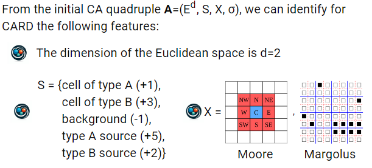
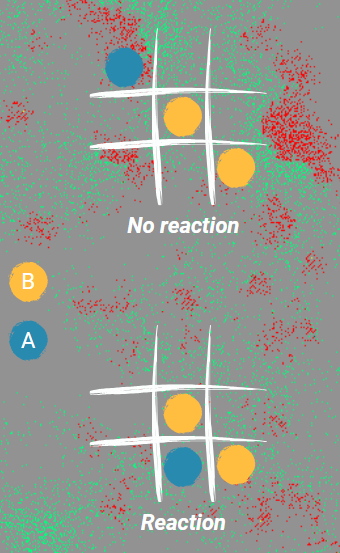

 CARD: Cellular Automata for Reaction-Diffusion problems
 We will introduce a particle simulation model based on Turing’s ideas: a system built on very simple rules and even randomness can nevertheless produce emergent behavior that is complex and elegant. Depending on the rules used, it is possible to represent different types of patterns: for example, if we had diffusion by gradient of particles concentration, we would obtain something similar to a zebra's coat. If instead we relied on stochastic diffusion of particles, we would observe the formation of particular 'half moon'-like structures.

 At this point is convenient to list the rules of CARD:
    

Here, we distinguish two kinds of particles:

    -Particles of type A are present from the initial step in a pseudo-stochastic generation background. Additionally, they are continuously generated from scattered sources on the grid. At a predefined frequency, additional particles of type A are introduced into the environment; 

    -On the other hand, particles of type B have the ability to react according to the reaction 2B + A = 3A if and only if type B particles are in the Moore neighborhood of A. At that point, the type A particle becomes type B. Particles of type B are continuously introduced into the environment from sources whose number is determined by the operator input. Unlike type A particles, those of type B are not regulated by a feed system: if, after a specific number of steps, they have not yet participated in the reaction, they lose energy until they are eliminated from the system.

   

In order to lunch the simulation, you have to firstly initialize the grid with allegro library with the bash script, and then specify the number of A-particles percentage and the number of B-particles sources (while the "life and death" conditions respectively on A-p and B-p have to be modified in the code). 
